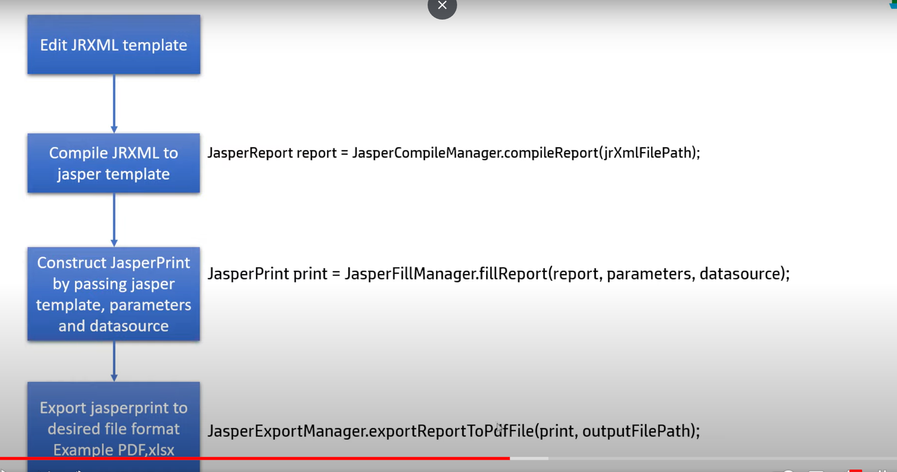
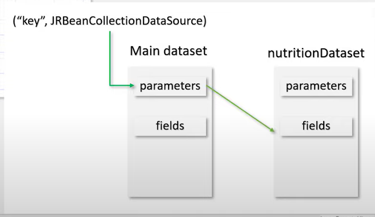

# IDE Tutorial

- Alt + Entr press korle local variable assign hoi
- ctrl + F full project e kono text search korar jonne use
- ctrl + N full project e file search korar jonne use hoi
- ctrl + G - ekta file jekono line e jaoar jonne use hoi
- ctrl + shift + enter - jekono line theke next new line e jete chaile

# Installing Maven in windows
1. Download the zip file
2. Past the apache folder to c drive (folder name like: apache-maven-3.9.5)
3. After pasting copy the folder url (like: C:\Program Files\apache-maven-3.9.5\bin)
4. Then Go to environment variable
5. Create two variable name "MAVEN_HOME", "M2_HOME" and for value past C:\Program Files\apache-maven-3.9.5
6. Edit the path variable and add two variable there "MAVEN_HOME\bin" and "M2_HOME\bin"
7. Without this "M2_HOME\bin" windows may be not recognize the maven

# Twilio.com(for otp)
1. Used email: itmasjoy@gmail.com
2. Used mobile number: 01968385155


# How to create github app

- Owned by: @Shariarbup
- App ID: 669676
- Client ID: Iv1.93bd50a5ac2e228d
- public link: https://github.com/apps/shariar-demo-coding
- client secret: a894a42a88b1cb08b5af5672779be74570167d75

- Go to Setting -> then go to developer setting(see in the lower portion) -> create github app
- provide home url and call back url - http://localhost:8080 (in my case)
- uncheck which is not necessary in my case(webhook)

# How to create google app

- Client ID: 254969945458-fbmtbh649piqc128rps1fv7dfpksqaei.apps.googleusercontent.com
- Client Secret: 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

- Go- https://console.cloud.google.com/
- Create an app
- Then got Rest API and Services -> Create credentials -> Oauth client id -> Applicatio Type(desktop App)


# Jasper studio

Dowload community Link- https://community.jaspersoft.com/files/file/19-jaspersoft%C2%AE-studio-community-edition/


# Jasper report different firld:
- Parameter - $P{} -> (eita params use kora jai) simple input to the subreport (<parameter_key>(string), value(object)), you can pass this to subreport or datasource
- Fields - $F{} -> Fields is the datasource object that are passed to the report, Fields are also contain multiple entries
  , ex: column entries in a table
- Variable - $V{} -> (jasper report e calculation er result kothao store kore rakhar jonne) Variables are not data passed to report that they are created in the report to hold aggregated values
  They are predefined variables in the jasper report
- Internationalization - $R{} -> This holds the key of the resource bundle to support internationalization. Based on the key and locale
  provided it gets corresponding value from resource
- There are some step for creating Jasper report which is given below
- 
- How Nutrition table get the value
- 

# Pagination
- ekbare 5 ta row return korle page er size-5 and page-1
- example: http://localhost:9090/posts?pageSize=5&pageNo=2&sortBy=title

# Multi threading
- https://www.mockaroo.com/
- Uporer ei site theke mock data populate kora jai 

# Query

## LEFT JOIN
`SELECT DISTINCT c.* FROM blog.customers c LEFT JOIN blog.orders o ON c.id = o.customer_id;`
- pura customer er list ta dibe customer_id order table e thakuk ba na thakuk

## RIGHT JOIN
`SELECT DISTINCT c.* FROM blog.customers c RIGHT JOIN blog.orders o ON c.id = o.customer_id;`
- ei query er mane hoilo sheishob Customer er list diba jader id order table e ashe

## INNER JOIN/ JOIN
`SELECT DISTINCT c.* FROM blog.customers c JOIN blog.orders o ON c.id = o.customer_id;`
- ei query er mane hoilo sheishob Customer er list diba jader id order table e ashe, ei query RIGHT JOIN er moto kaj korbe


## ONLY GETTING CUSTOMER NAME
`SELECT c.first_name FROM blog.orders o JOIN  blog.customers c ON o.customer_id = c.id;`
- ei query er mane hoilo Order table e joto gula customer ashe shei customer gular name er list return korbe

## GETTING CUSTOMER NAME AND THEIR ORDER COUNT
`SELECT c.first_name, COUNT(o.id) FROM blog.orders o JOIN  blog.customers c ON o.customer_id = c.id GROUP BY
c.first_name;`
- order table joto gula custutomer ashe sheigular distinct name and order count ashbe

# Caching
- Caching korar jonne amader @EnableCaching application upor tag diya 
- And nicher method gula amader service method er upor add kora lagbe
For Update method:
- @CachePut(cacheNames = "users", key = "#userDto.userId")
For get method
- @Cacheable(cacheNames = "users", key = "#userId")
For Delete method
- @CacheEvict(cacheNames = "users", key = "#userId")
- 
# Test Container 
- Required dependency
  ```
     <dependency>
      <groupId>org.springframework.boot</groupId>
      <artifactId>spring-boot-testcontainers</artifactId>
      <scope>test</scope>
    </dependency>
    <dependency>
      <groupId>org.testcontainers</groupId>
      <artifactId>junit-jupiter</artifactId>
      <scope>test</scope>
    </dependency>
  ```
  - Mariadb Test container dependency
    ```
<dependency>
    <groupId>org.testcontainers</groupId>
    <artifactId>mariadb</artifactId>
    <version>1.19.3</version>
    <scope>test</scope>
</dependency>
    ```
- Added code for test containers

    ```
    @TestContainers
     
    ```
# How to install docker Docker
- install wsl 2(windows subsystem linux) backend
- Docker Desktop Installation guideline - `https://docs.docker.com/desktop/install/windows-install/`
- check docker version --- docker -v 
- pull docker image from docker hub --- docker pull hello-world (hello-world name er image docker hub theke pull korar niyom)
## OpenJDK 18 run docker
- docker images (now docker desktop e koto gulo image ashe sheita dekhabe)
- docker pull openjdk:18 (ekhane openjdk er 18 version download korar niyom)
- docker search MYSQL (eitar maddhome cmd te image search kora jai)
- docker images (joto gulo image locally ashe oigula show korbe)
## Python run from docker
- docker run python (python image run korar way)
- docker ps (recent container dekhar jonne)
- docker ps -a (shob container dekhar jonne)
- docker run -env MYSQL_ROOT_PASSWORD=root( docker environment e mysql password daoar jonne)
- docker run --name pythonContainer -d python (ekhane d mane detach and pythonContainer conatiner er name)
- docker run --name pythonContainer -it -d python(it mane hoilo interactive)
- docker exec -it container_id python3 (ekta container er moddhe python3 exec korbe)
## MYSQL run from docker
- MySQL run korar miyom- docker run mysqlDb -e MYSQL_ROOT_PASSWORD=root -d mysql
- docker inspect mysqlDb(mysqlDb container er full structure dekhabe)
- docker exec -it mysqlDb bash(eita mysqlDb container run hbe)
- then mysql -p er maddhome password dite hobe
- exit (ei command dile cmd off kora jai)
## Nginx server run from docker
- docker run --name nginxServer -d -p 8080:80 nginx (ekhane d= detach and p= port ebong command tar mane jodi container 8080 port er then nginx cholbe 80 port)
## apache er docker name httpd
- docker pull httpd
- docker run --name httpdServer -d -p 8081:80 httpd (apache server 8081 port e run korlam)
- docker ps (eitar maddhome ki ki container ekhon running ashe sheita amra check korte parbo)
## docker single containter stop korar niyom
- docker stop container_name/container_id
## docker theke jekono container remove korar niyom
- docker rm container_id
## ek shathe onekgulo container stop korar niyom
- docker rm container_id container_id container_id
## images gulo remove korar upai
- docker rmi openjdk:18 (rmi= remove image)
## docker container restart korar niyom
- docker restart pythonContainer1
# Docker hub e login korar niyom
- docker login (docker hub e login korar jonne for publishing the local image)
- docker commit ( edited image k commit korar jonne)
- docker push ( uploaded the local image to docker hub)
- docker copy ( local file theke copy korar jonne use hoi)
- docker logs container_name ( er maddhome amra kono container er log check korte parbo)
- docker volume ( docker container eta use korbe for storing the data)
- docker logout ( docker hub theke log out korar niyom)
# How to craete docker file in locally
Docker file name should like Dockerfile
## template of a docker file
```
FROM ubuntu
MAINTAINER shariar
RUN apt update
CMD [ "echo", "This is my first image"]
```
- docker build -t myubuntuimage . (ekhane . mane hoile current directory j docker file thakbe oita run hobe and image er name hobe myubuntuimage)
- 

  
